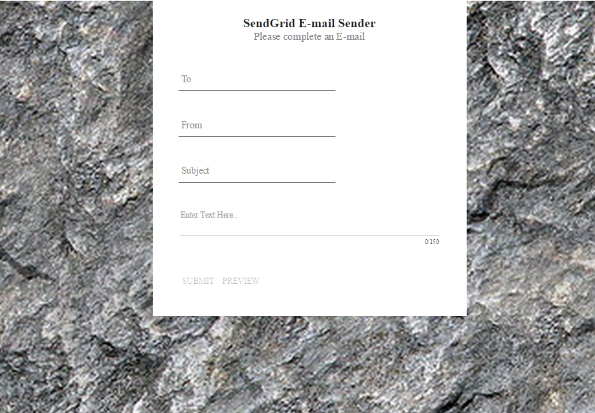
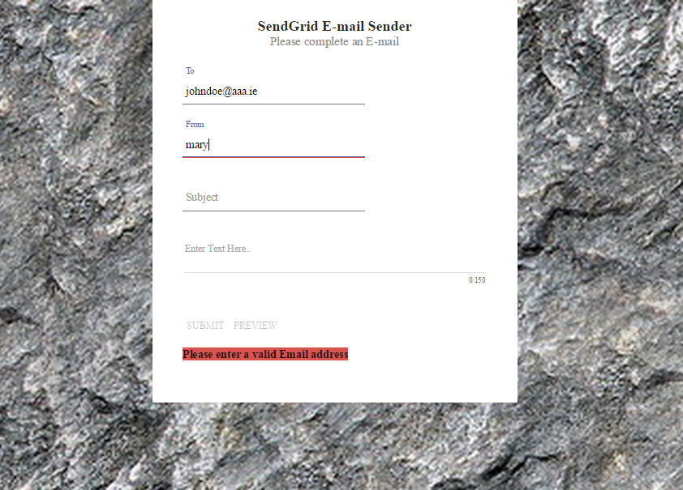
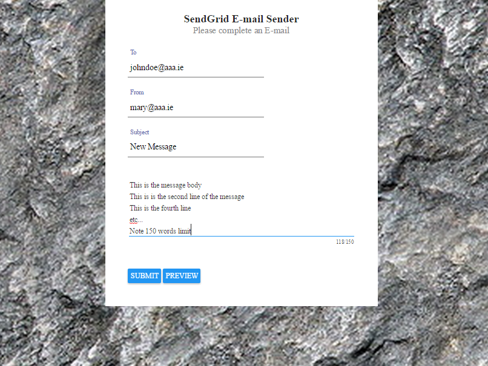
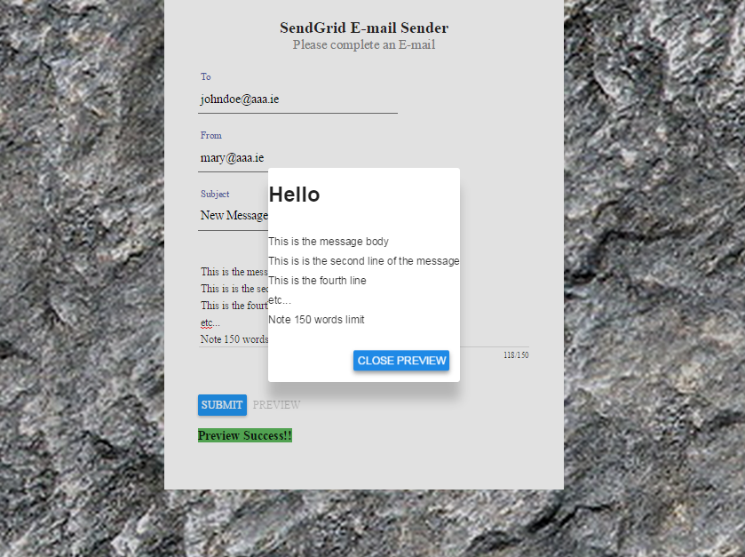

## SendGrid-Node-ejs

This Repository uses the [SendGrid](https://sendgrid.com/) cloud E-mail delivery service, Nodejs and [ejs](https://github.com/tj/ejs) server side templating. 

- Run the program and open browser
- The background image renders automatically
- There is a delay of 2 sec until a blank form is presented. The delay stops unwanted flickering for better UX.
- The delay is created using the resolve property of $routeProvider. Basically the route __/__ will not render until the promise resolves.
- Complete the email form
- Form validation is done by Angular
- The __Submit__ and __Preview__ buttons only become active when the form is completed correctly
- Preview will do the following: 
	- send the completed email form to Node server
	- Node extracts the email
	- Using RegEx Node replaces all '\n' characters with &lt;br/&gt; 
	- The messsage goes through ejs email template where extra formatting may be done
	- The output is sent back to the client
	- An Angular Material Modal (dialog box) opens to display exactly how the Email will look

- Send will do the following: 
	- send the completed email form to Node server 
	- Node extracts the email
	- Using RegEx Node replaces all '\n' characters with &lt;br/&gt
	- The messsage goes through ejs email template where extra formatting may be done
	- The email is sent using SendGrid to the desired address
	- Success/Failure message is sent back to client and rendered in the view 

## Main Technologies Used

- [NodeJS](http://nodejs.org/)
- [ExpressJS](http://expressjs.com/)
- [SendGrid](https://sendgrid.com/)
- [ejs](https://github.com/tj/ejs) server side templating
- [AngularJS](https://angularjs.org/)
- [Angular Material](https://material.angularjs.org/#/) - new framework containing UI components
- Angular-messages - form message handling (new to Angular 1.3x)
- Angular-sanitize - used $sce service to allow raw html to be rendered in Angular

## Inspiration and Credits

- [SendGrid NodeJS Example](https://github.com/sendgrid/sendgrid-nodejs-example)
- LearnCode Academy You Tube video [1](https://www.youtube.com/watch?v=zrXOjWICmGw) 
- LearnCode Academy You Tube video [2](https://www.youtube.com/watch?v=FrB8mxdWR7o)
- Background image downloaded from [http://freeseamlesstextures.com/](http://freeseamlesstextures.com/)
- The [Angular Material](https://material.angularjs.org/#/) form styling based on a tutorial from [scotch.io](https://scotch.io/).
- [stackoverflow Answer](http://stackoverflow.com/questions/784539/how-do-i-replace-all-line-breaks-in-a-string-with-br-tags/784547#784547) - RegEx code to convert '\n' to &lt;br/&gt; (need to format line breaks in html)

## Usage

- Open an account with [SendGrid](https://sendgrid.com/)
- clone the repository
- Copy _.env.example_ to _.env_
- Open _.env_ and enter your SendGrid account credentials and save
- _bower install_
- _npm install_
- _node server.js_
- Browse to _http://localhost:8080/_
- Enter Email details into the [Angular Material](https://material.angularjs.org/#/) form presented
- Preview button will connect to Node server and return the output of the ejs template and render it as HTML in a Modal window 
- The Submit button - sends Email to the _To_ Email address
- Wait a while
- You will get confirmation when the promise resolves

## Screen Shots

	

	

	

	

Michael Cullen
2014

