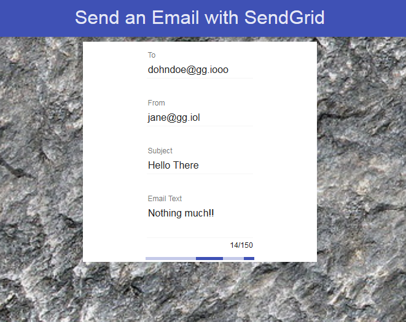
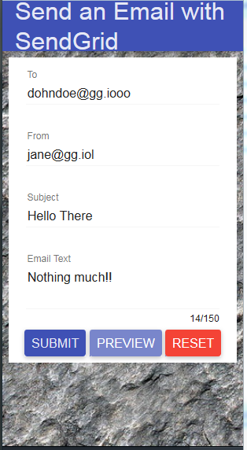
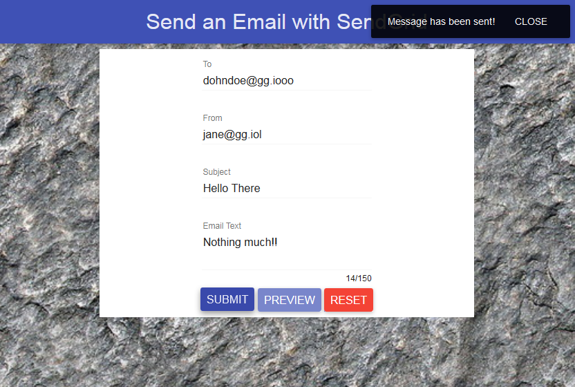

## SendGrid-Node-ejs

This Repository uses the [SendGrid](https://sendgrid.com/) cloud E-mail delivery service. 

- Run the program and open browser
- The background image renders automatically
- There is a delay of 2 sec until a blank form is presented. The delay stops unwanted flickering for better UX.
- The delay is created using the resolve property of $routeProvider. Basically the route __/__ will not render until the promise resolves.
- Complete the email form
- Form validation is done by Angular
- The __Submit__ and __Preview__ buttons only become active when the form is completed correctly

- Preview will do the following: 
	- send the completed email form to Node server
	- Node extracts the email
	- Using RegEx Node replaces all '\n' characters with &lt;br/&gt; 
	- The messsage goes through ejs email template where extra formatting may be done
	- The output is sent back to the client
	- An Angular Material Modal (dialog box) opens to display exactly how the Email will look

- Send will do the following: 
	- send the completed email form to Node server 
	- Node extracts the email
	- Using RegEx Node replaces all '\n' characters with &lt;br/&gt;
	- The messsage goes through ejs email template where extra formatting may be done
	- The email is sent using SendGrid to the desired address
	- Success/Failure message is sent back to client and rendered in the view 

## Main Technologies Used

- [NodeJS](http://nodejs.org/)
- [ExpressJS](http://expressjs.com/)
- [SendGrid](https://sendgrid.com/)
- [ejs](https://github.com/tj/ejs) server side templating
- [AngularJS](https://angularjs.org/)
- [Angular Material](https://material.angularjs.org/#/) - 
new framework containing UI components
- Angular-messages - form message handling (new to Angular 1.3x)
- Angular-sanitize - used $sce service to allow raw html to be rendered in Angular
- [Gulp](http://gulpjs.com/) streaming build system
- [jshint](http://jshint.com/) javascript linter
- [gulp-nodemon](https://www.npmjs.com/package/gulp-nodemon) nodemon wrapper for gulp that restarts the app

## Inspiration and Credits

- [SendGrid NodeJS Example](https://github.com/sendgrid/sendgrid-nodejs-example)
- LearnCode Academy You Tube video [1](https://www.youtube.com/watch?v=zrXOjWICmGw) 
- LearnCode Academy You Tube video [2](https://www.youtube.com/watch?v=FrB8mxdWR7o)
- Background image downloaded from [http://freeseamlesstextures.com/](http://freeseamlesstextures.com/)
- The [Angular Material](https://material.angularjs.org/#/) form styling based on a tutorial from [scotch.io](https://scotch.io/).
- [stackoverflow Answer](http://stackoverflow.com/questions/784539/how-do-i-replace-all-line-breaks-in-a-string-with-br-tags/784547#784547) - RegEx code to convert '\n' to &lt;br/&gt; (need to format line breaks in html)
- [Gulp plumber](https://www.npmjs.com/package/gulp-plumber)
- [smashingmagazine](http://www.smashingmagazine.com/2014/06/11/building-with-gulp/) - building with Gulp
- [sitepoint Gulp intro](http://www.sitepoint.com/introduction-gulp-js/)
- [gulp-nodemon](https://github.com/JacksonGariety/gulp-nodemon)
- [justinmccandless blog on gulp](http://www.justinmccandless.com/blog/A+Tutorial+for+Getting+Started+with+Gulp)
- [kycosoftware blog on gulp](http://www.kycosoftware.com/blog/article/simple-and-awesome-gulp-setup)
- I got most of my jshint config file (.jshintrc) from this [leanpub Grunt book](https://leanpub.com/grunt/read)

## Usage

- Open an account with [SendGrid](https://sendgrid.com/)
- clone the repository
- Copy _.env.example_ to _.env_
- Open _.env_ and enter your SendGrid account credentials and save
- _bower install_
- _npm install_
- _gulp_
- Browse to _http://localhost:8080/_
- Enter Email details into the [Angular Material](https://material.angularjs.org/#/) form presented
- Preview button will connect to Node server and return the output of the ejs template and render it as HTML in a Modal window 
- The Submit button - sends Email to the _To_ Email address
- Wait a while
- You will get confirmation when the promise resolves

## Gulp Streaming Build setup

I have set up the following gulp tasks:

- clean
	- deletes _/dist/_ (including all sub directories)

- _copy-html_
	- get html files from _/src_ 
	- streams to _/dist/_

- _css_ (for all css files)
	- gets css from _/src_ and _/lib_
	- concatenates to app.css
	- minifies it
	- renames file to app.min.css
	- streams to _/dist/css/_

- _angular_ (for front end javascript)
	- get js code
	- pass through jshint linter
	- concatenate to app.js
	- Annotate (because I do not write Angular in the syntax required for minified code to be read)
	- remove console and debugger statements
	- minify
	- rename to app.min.js
	- stream to _/dest/js/_

- _node-scripts_ (for Node back-end javascript only)
	- get js code
	- pass through jshint linter

- _imagemin_ (NOTE:this task no longer compresses image files as package _gulp-imagemin_ was breaking npm install)
	- read images from _/src/_
	- minify (compress) images
	- check if different to files on _/dist/_ if they exists
	- stream to _/dist/img/_

- _lib-scripts_ 
	- read library javascript files from _/lib/_
	- they are minified already
	- concatenate to lib.min.js
	- stream to _/dist/js/_

- _lib-maps_ (needed to unminify) 
	- read library map files from _/lib/_
	- stream to _/dist/js/_

- _watch_  
	- specifies directories to look for file changes in
	- run the task associated with the watch where the file change occurred

- _unit:test_
	- starts Karma test runner 
	- runs through the unit tests once

- _unit:tdd_
	- starts Karma test runner 
	- runs through the unit tests 
	- runs the unit tests each time a file change is detected

- _nodemon_ (restarts node server) 
	- runs node server.js to start node server
	- monitors css, js, html files for changes
	- on server start run tasks ['lib-scripts', 'lib-maps', 'angular', 
	  'copy-html', 'css','imagemin']
	- on file change run watch task

## Unit Testing

I have added some unit tests created using the following tools:
 
 - [Karma](http://karma-runner.github.io/0.12/index.html) test runner
 - [Jasmine](http://jasmine.github.io/) test framework

Two Gulp tasks are created that will run the unit tests:

- __unit:test__ 
- __unit:tdd__

## End to End Testing

I have added two Protractor (Selenium Webdriver) tests.

- Test 1: check browser title
	- Open browser
	- check the title is "Send An Email"

- Test 2: check preview button remains enabled when preview modal is open
	- Open browser
	- populate each field of the Form with valid entries
	- click the preview button to open modal window
	- check that the preview button does not get disabled

## Screen Shots

	

	Preview of Email

	

Progress Bar when waiting for response

	

Fully Responsive thanks to FlexGrid

	

Toast Messages

Michael Cullen
2014

